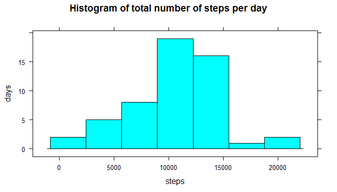
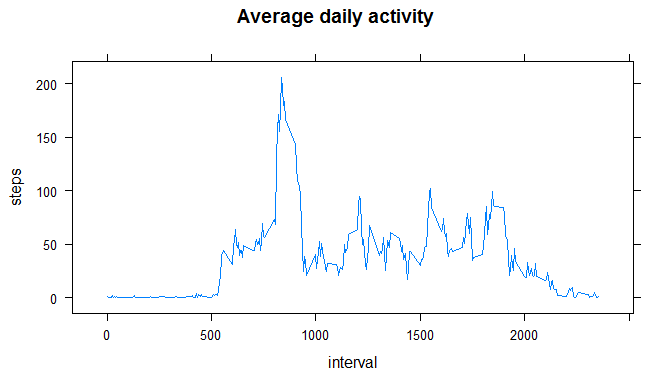
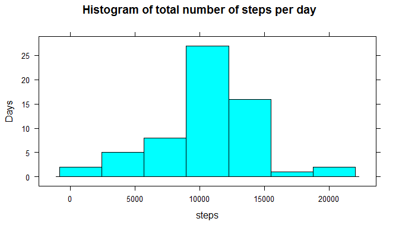
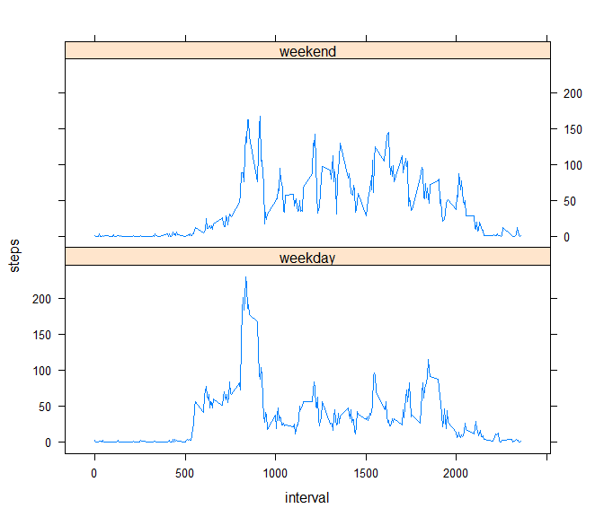

# Reproducible Research: Peer Assessment 1


## Loading and preprocessing the data

The dataset, [activity monitoring data](https://d396qusza40orc.cloudfront.net/repdata%2Fdata%2Factivity.zip) [52K], for this assignment was downloaded from the course web site and saved as **repdata_data_activity.zip**.

The variables included in this dataset are:

- **steps**: Number of steps taking in a 5-minute interval (missing values are coded as  NA )
- **date**: The date on which the measurement was taken in YYYY-MM-DD format
- **interval**: Identifier for the 5-minute interval in which measurement was taken

The dataset is stored in a comma-separated-value (CSV) file and there are a total of 17,568 observations in this dataset. 


```r
if (!file.exists("activity.csv")) { unzip("repdata_data_activity.zip")}
activity.data <- read.csv("activity.csv",colClasses=c("integer","Date","integer"))
```

**repdata_data_activity.zip** is unzipped to produce **activity.csv** and loaded for analysis.

## Mean total number of steps taken per day

Missing values in the dataset are ignored for the analysis in this section.

```r
# compute total number of steps taken per day, its mean and median 
daily.steps <- aggregate(steps ~ date, data = activity.data, sum)
daily.steps.mean <- mean(daily.steps$steps)
daily.steps.median <- median(daily.steps$steps)
```


```r
# use lattice plotting system
library(lattice)
with(daily.steps, histogram(steps, type = "count", 
                            main = "Histogram of total number of steps per day", ylab = "days"))
```

 

Mean total number of steps taken per day is 10766.18868.

Median total number of steps taken per day is 10765.00000.

## Average daily activity pattern

Missing values in the dataset are ignored for the analysis in this section.

```r
# average number of steps taken, averaged across all days  
interval.mean <- aggregate(steps ~ interval, data = activity.data, mean)
# interval with maximum number of steps on average across all days 
max.steps.interval <- interval.mean$interval[which.max(interval.mean$steps)]
```

```r
with(interval.mean, xyplot(steps ~ interval, type = "l", main = "Average daily activity"))
```

 

The 5-minute interval starting from 835, on average across all the days in the dataset, contains the maximum number of steps.

## Imputing missing values

```r
# calculate total number of missing values
missing.counts <- length(which(is.na(activity.data)))

# copy original data frame
imputed.data <- activity.data

# impute missing values with interval mean
for (i in which(is.na(activity.data))){
    imputed.data$steps[i] <- interval.mean$steps[interval.mean$interval == imputed.data$interval[i]]
}

# compute total number of steps taken per day, its mean and median 
daily.steps <- aggregate(steps ~ date, data = imputed.data, sum)
daily.steps.mean <- mean(daily.steps$steps)
daily.steps.median <- median(daily.steps$steps)
```

The total number of missing values in the dataset is 2304.

The mean for a matching 5-minute interval will be used to impute the missing values in the dataset.


```r
with(daily.steps, histogram(steps, type = "count", main = "Histogram of total number of steps per day", ylab = "Days"))
```

 

Mean total number of steps taken per day is 10766.18868.  

Mean total number of steps taken per day is 10766.18868.

Compared to the estimates from the first part of the assignment, where missing values are ignored, the mean is the same while the median is different.

By using the mean for a matching 5-minute interval for imputing missing data,

* we see an increase in the number of days where the total number of steps is close to the mean (middle band of the histogram)

* we see little impact on the general distribution of the total number of steps taken per day. 

## Activity patterns between weekdays and weekends

This analysis use the dataset from previous section.


```r
# create factor variable for 'weekday' & 'weekend'
imputed.data$weekday <- factor(ifelse(weekdays(imputed.data$date) == "Sunday" | weekdays(imputed.data$date) == "Saturday", "weekend", "weekday"))

with(aggregate(steps ~ interval + weekday, data = imputed.data, mean), 
     xyplot(steps ~ interval | weekday, layout = c(1,2), type ="l"))
```

 
